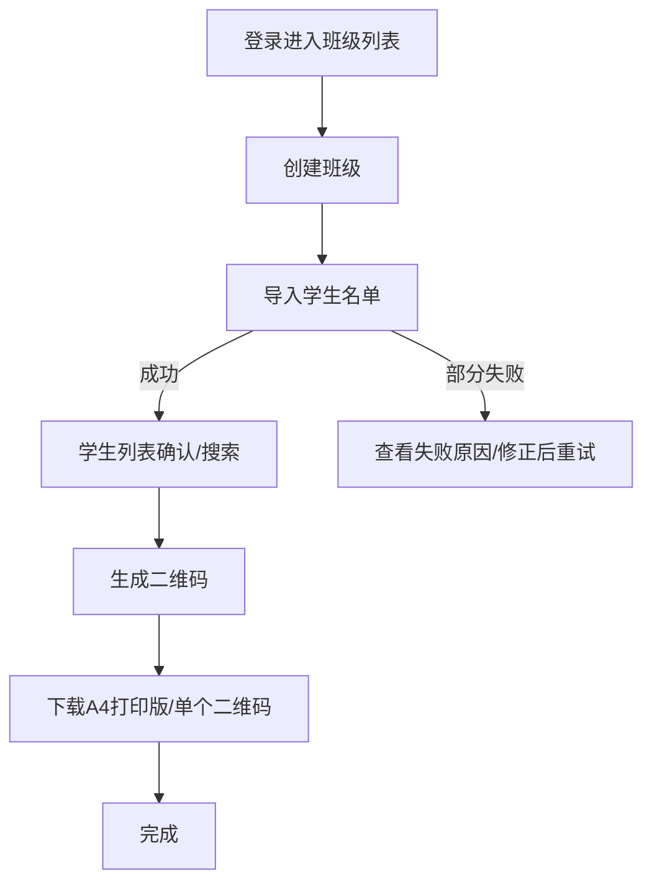
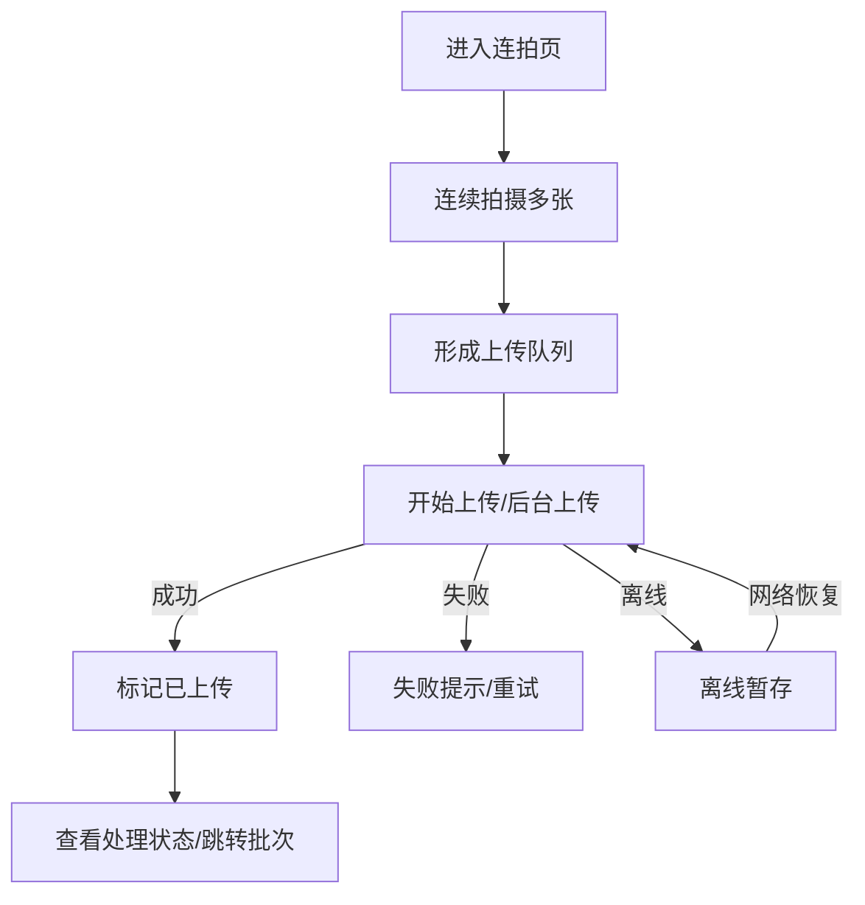
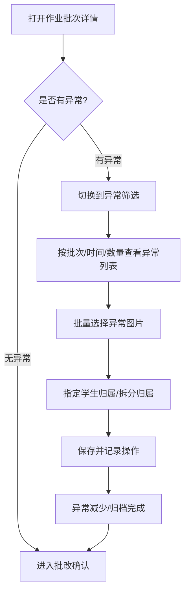
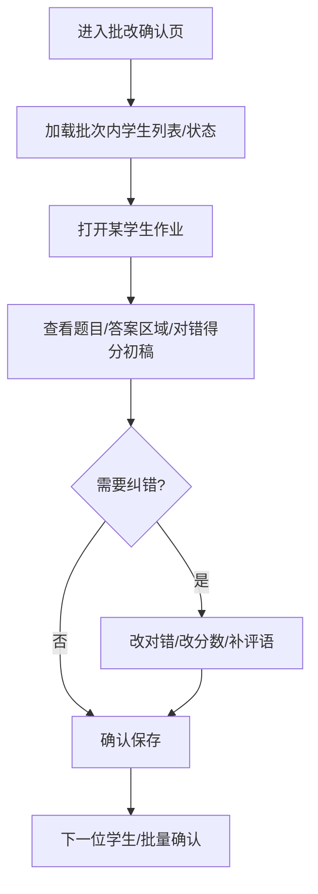
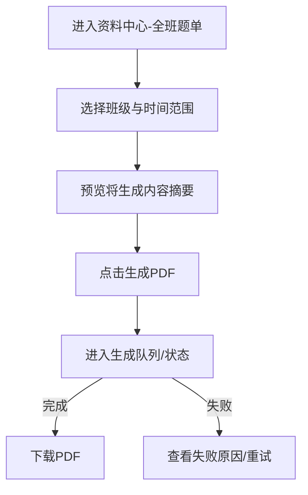
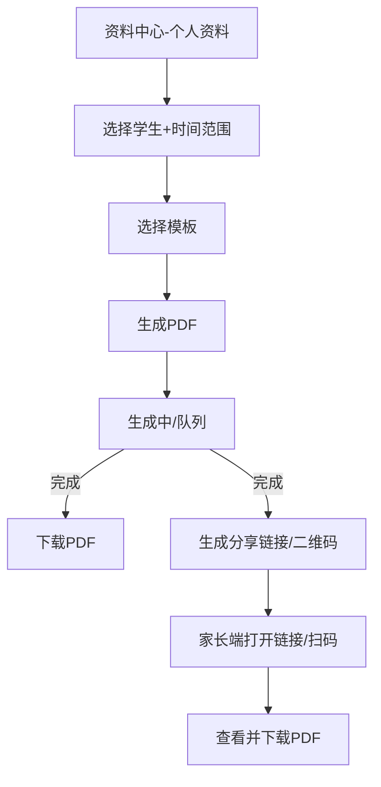

# 师策汇 UI/UX 规格说明（基于 PRD）

> 依据文档：`师策汇_PRD.md`  
> 覆盖平台：PC Web（教师端，Next.js）+ 微信小程序（教师端/家长学生端，uni-app）  
> 说明：本规格严格基于 PRD 描述；未在 PRD 明确的信息以“假设/待确认”标注。

## 1. Introduction（简介）

本文件定义师策汇的用户体验目标、信息架构、关键用户流程、关键界面布局、组件库与视觉规范，用于指导设计与前端开发交付一致、可用、可扩展的界面与交互实现。

### 1.1 Overall UX Goals & Principles（整体 UX 目标与原则）

#### 1.1.1 Target User Personas（目标用户画像）

- **教师（高频效率用户）**
  - 使用环境：课间/办公室，碎片时间，多任务并行；手机端弱网场景常见。
  - 核心目标：拍得快、归得准、错得能修、数据能用（看板/档案/PDF）。
  - 关键痛点：连拍卡顿、异常处理复杂、识别不可信、找数据费劲。
- **学生（任务执行者）**
  - 使用环境：手机为主；对操作引导依赖较高。
  - 核心目标：知道要做什么练习、快速完成并获得反馈。
- **家长（监督与资料接收者）**
  - 使用环境：手机为主；更关注“看得懂、可下载/可打印、可信”。
  - 核心目标：查看作业结果、下载练习册/复习册、监督完成练习。

#### 1.1.2 Usability Goals（可用性目标）

- **学习成本**：新教师在 5 分钟内完成“建班-导入-下载二维码”（对应 UC1/FR1/FR2）。
- **高频效率**：教师在小程序端完成一次“连拍采集”时，除拍摄外的额外点击尽量 ≤3（与 PRD“少操作”一致）。
- **可恢复性**：异常（缺码/识别冲突/上传失败）必须可被“批量处理+可撤销”，避免卡死流程（对应 FR5、风险 R1/R2）。
- **可追溯性**：任何自动结论（归档/识别/批改）可回溯来源并可被修正（对应 FR4/FR7/NFR5）。
- **一致性**：Web 与小程序在术语、状态、颜色语义上保持一致（例如：待处理/处理中/已完成/失败）。

#### 1.1.3 Design Principles（设计原则）

1. **清晰优先**：术语一致、信息层级明确，避免“聪明但难懂”的交互。
2. **渐进呈现**：先给“可用初稿”和“下一步动作”，深度细节按需展开（符合异步处理与教师节奏）。
3. **默认自动化，失败可修复**：正常路径尽量自动完成，异常路径提供批量工具与可撤销能力。
4. **即时反馈**：上传、识别、生成 PDF 等耗时任务必须有明确状态与预计完成提示。
5. **可信与可控**：所有关键数据（归档、分数、错题）提供“证据视图”（图片/时间/批次）与修正入口。

### 1.2 Change Log（变更记录）

| Date | Version | Description | Author |
| --- | --- | --- | --- |
| 2026-01-16 | v1.0 | 基于 `师策汇_PRD.md` 输出首版 UI/UX 规格说明 | Codex |

## 2. Information Architecture (IA)（信息架构）

### 2.1 Site Map / Screen Inventory（站点地图/页面清单）

```mermaid
graph TD
  A[入口] --> A1[教师 Web 登录]
  A --> A2[小程序登录/绑定]

  subgraph W[教师端 PC Web]
    W1[班级列表]
    W2[班级详情]
    W21[学生列表]
    W22[二维码下载/打印]
    W23[作业批次列表]
    W24[批次详情-学生/异常筛选]
    W25[异常批量处理/归属修正]
    W26[批改确认]
    W3[数据看板]
    W31[题目排行]
    W32[知识点排行]
    W33[下钻-题目/知识点详情]
    W4[学生档案]
    W41[时间轴]
    W42[错题列表]
    W43[薄弱点概览-按知识点聚合]
    W5[资料中心]
    W51[全班易错题单-PDF生成/下载]
    W52[个人练习册/复习册-PDF生成/下载/分享]
    W6[练习任务]
    W61[任务创建/下发]
    W62[任务完成统计]
    W7[设置]
  end

  subgraph M1[小程序-教师端]
    M11[连拍采集]
    M12[上传队列/处理状态]
    M13[批次处理入口(查看结果/跳转Web)]
    M14[我的/设置]
  end

  subgraph M2[小程序-家长/学生端]
    M21[通知/作业结果列表]
    M22[作业结果详情/错题入口]
    M23[练习任务列表]
    M24[练习作答/提交]
    M25[资料下载(PDF)]
    M26[我的]
  end

  A1 --> W1
  A2 --> M11
  A2 --> M21
```

### 2.2 Navigation Structure（导航结构）

**Primary Navigation（Web，教师端）**

- 班级
- 作业（批次/异常/批改确认）
- 数据
- 资料
- 练习任务
- 设置

**Secondary Navigation（Web，建议）**

- 班级详情内：学生｜二维码｜作业批次
- 数据看板内：题目｜知识点｜趋势（若本期不做趋势，可隐藏入口）
- 资料中心内：全班题单｜个人资料｜生成记录

**小程序导航（建议）**

- 教师端：底部 Tab（连拍｜队列｜班级｜我的）或（连拍｜班级｜我的）；队列可作为连拍子页，依据实现复杂度选择。
- 家长/学生端：底部 Tab（结果｜练习｜资料｜我的）。

**Breadcrumb Strategy（面包屑）**

- Web 端全程提供面包屑，保证教师“从班级/批次/学生”可一键返回：
  - 示例：班级 / 七年级1班 / 作业批次 / 2026-01-16 / 异常处理

## 3. User Flows（关键用户流程）

> 说明：每个流程包含“目标、流程图、边界与错误处理”。流程编号与 PRD 的 UC/FR 关联。

### 3.1 流程 A：建班-导入-二维码下载（UC1，FR1/FR2）

**用户目标**：教师在 Web 端完成班级建档，并拿到可打印二维码贴纸。



**Edge Cases & Error Handling**

- 导入失败：展示失败行、原因（缺字段/重复编号），提供“下载错误报告”和“再次导入”。
- 二维码生成失败：提供重试与错误提示（例如“系统繁忙”），不影响班级与学生档案存在。

**Notes**

- PRD 未要求“二维码发放确认”，本期仅提供下载/打印指引文案（假设）。

### 3.2 流程 B：小程序连拍采集与上传队列（UC2，FR3）

**用户目标**：教师在小程序端连续拍摄并批量上传作业，过程不阻塞。



**Edge Cases & Error Handling**

- 相册权限/相机权限未授予：引导授权并提供“去设置”入口。
- 弱网/断网：明确展示“离线暂存中”，并提示“网络恢复后自动续传”。

**Notes**

- 处理完成（识别/初稿）为异步回流，不在连拍流程内阻塞。

### 3.3 流程 C：自动归档与异常批量处理（FR4/FR5）

**用户目标**：教师在 Web 端按“批次”查看归档结果，并批量修正异常。



**Edge Cases & Error Handling**

- 识别冲突：在异常项上展示冲突原因（例如“识别到多个码/码损坏”），默认归入异常池。
- 误修正：必须支持撤销/重新分配，并提示“变更已记录”（对应可追溯性）。

**Notes**

- Web 端的“按批次批量修正”是 FR5 的关键点；批次维度在 UI 上必须显性。

### 3.4 流程 D：批改初稿生成与教师确认纠错（UC3，FR6/FR7）

**用户目标**：教师在 Web 端对批改初稿快速纠错并确认，形成最终批改记录。



**Edge Cases & Error Handling**

- 初稿尚未生成：显示“处理中”占位（Skeleton/状态标签），提供“稍后刷新”与“返回列表”。
- OCR/匹配明显错误：提供“标记为待处理/重新识别”入口（假设，若后端不支持则仅提供反馈入口）。

**Notes**

- 批改确认页面需要支持“批量操作”（例如批量确认/批量跳过），以符合教师节奏（PRD 的高频效率目标）。

### 3.5 流程 E：全班共性易错题单 PDF 生成（FR11）

**用户目标**：教师在 Web 端选择时间范围并生成全班题单 PDF。



**Edge Cases & Error Handling**

- 选定范围内数据不足：提示“无足够错题数据”，引导调整时间范围。
- 生成耗时：提供状态与预计耗时说明；允许用户离开页面后在“生成记录”查看进度。

### 3.6 流程 F：个人练习册/复习册生成与家长访问（UC4，FR12/FR15）

**用户目标**：教师生成个人 PDF 并分享给家长下载/打印。



**Edge Cases & Error Handling**

- 分享链接无权限：提示“无访问权限/已过期”，引导联系老师重新生成。
- 家长端网络差：提供“复制链接/稍后下载”，并展示文件大小。

**Notes**

- PRD 要求“生成记录保存模板标识”（FR12），因此模板选择必须是显性控件（下拉/卡片）。

### 3.7 流程 G：推题下发与学生练习闭环（FR13/FR14）

**用户目标**：教师为错题生成巩固练习任务，学生完成并提交，教师查看完成情况。

```mermaid
flowchart TD
  S[教师端选择错题/知识点] --> R1[获取同考点巩固题列表]
  R1 --> C1[教师确认题目/数量]
  C1 --> A1[选择下发对象(学生/班级)]
  A1 --> P1[生成练习任务]
  P1 --> S1[学生端领取任务]
  S1 --> D1[学生作答并提交]
  D1 --> F1[生成完成状态/正确率]
  F1 --> T1[教师端查看完成统计]
```

**Edge Cases & Error Handling**

- 巩固题不足：提示“题库覆盖不足”，允许减少数量或改用“仅下发错题再练”（假设/待确认）。
- 学生未绑定身份：提示绑定流程；未绑定时允许“家长代领”（假设/待确认）。

## 4. Wireframes & Mockups（线框与视觉稿）

### 4.1 Primary Design Files

**Primary Design Files:** 待补充（建议使用 Figma；Web 与小程序同一文件/同一套 Tokens）。

### 4.2 Key Screen Layouts（关键页面布局说明）

> 说明：以下为实现级布局与状态要求；视觉细节由设计稿补充。

#### 4.2.1 Web｜班级列表

**Purpose:** 快速进入班级，完成建班与导入入口。

**Key Elements:**
- 班级卡片/表格：名称、年级、学生数、最近批改时间
- 主按钮：创建班级、导入学生
- 搜索/筛选：按年级/学科（可选）

**Interaction Notes:** 创建/导入完成后给予明确成功反馈，并引导进入“二维码下载”。

**Design File Reference:** 待补充

#### 4.2.2 Web｜班级详情（学生｜二维码｜作业批次）

**Purpose:** 班级内的工作台，承载学生管理、二维码、批次入口。

**Key Elements:**
- 二级导航：学生｜二维码｜作业批次
- 学生列表：搜索、分页、状态（是否有作业/是否有异常）
- 二维码下载：A4 打印版/单个二维码；打印指引文案

**Interaction Notes:** 二维码下载操作要可追溯（记录生成时间/文件），便于补打。

**Design File Reference:** 待补充

#### 4.2.3 小程序（教师）｜连拍采集

**Purpose:** 最高频入口，优先保障“快、稳定、不断拍”。

**Key Elements:**
- 取景框/拍摄按钮：明确引导“二维码需入镜”（与风险 R1 对齐）
- 计数器：已拍/待上传
- 入口：上传队列/状态

**Interaction Notes:** 拍摄后立即反馈“已加入队列”；弱网时显示“离线暂存中”。

**Design File Reference:** 待补充

#### 4.2.4 小程序（教师）｜上传队列/处理状态

**Purpose:** 让教师确信“系统在工作”，并能处理失败重试。

**Key Elements:**
- 队列列表：缩略图、状态标签（待上传/上传中/成功/失败/处理中）
- 批量操作：重试失败项、清理已成功项（需二次确认）
- 批次入口：跳转查看批次结果（Web 优先）

**Interaction Notes:** 失败原因要可读（网络/权限/服务端），并提供可操作下一步。

**Design File Reference:** 待补充

#### 4.2.5 Web｜作业批次详情（学生/异常筛选）

**Purpose:** 批次的“总控台”：筛选、处理异常、进入批改确认。

**Key Elements:**
- 批次信息条：时间、来源（连拍）、总数、异常数、处理进度
- 筛选：学生/异常；支持按学生搜索
- 异常列表：缩略图 + 可能原因（缺码/冲突）

**Interaction Notes:** 异常处理提供“批量分配到学生/拆分分配/撤销记录”。

**Design File Reference:** 待补充

#### 4.2.6 Web｜批改确认

**Purpose:** 低成本纠错与确认，形成最终批改记录。

**Key Elements:**
- 左侧：学生列表/进度（未处理/已确认/待处理）
- 右侧：作业详情（题目/答案区域/初稿对错得分）
- 快捷纠错：一键切换对错、分数输入、评语快捷短语

**Interaction Notes:** 提供键盘快捷（↑↓切题，Enter确认）与批量确认能力（可选）。

**Design File Reference:** 待补充

#### 4.2.7 Web｜数据看板（题目/知识点）

**Purpose:** 帮教师快速决定“讲什么、练什么”。

**Key Elements:**
- 时间范围选择器
- 排行榜：题目错误率、知识点错误率
- 下钻：题目/知识点详情（涉及学生列表、错题样例）

**Interaction Notes:** 重点突出 Top N 与趋势（若本期不做趋势，保留接口位）。

**Design File Reference:** 待补充

#### 4.2.8 Web｜学生档案（时间轴/错题/薄弱点）

**Purpose:** 支撑长期追踪与复习资料生成。

**Key Elements:**
- 时间轴：按批次/日期聚合
- 错题列表：支持筛选（时间/知识点）
- 薄弱点概览：按知识点聚合，至少支持按错误数量排序（对应 FR10）

**Interaction Notes:** 从薄弱点卡片一键跳转到“生成个人资料/下发练习任务”。

**Design File Reference:** 待补充

#### 4.2.9 Web｜资料中心（PDF 生成/下载/分享）

**Purpose:** 把数据转化为“可交付物”。

**Key Elements:**
- 生成表单：班级/学生、时间范围、模板选择（个人资料）
- 生成队列：状态、失败原因、重试
- 下载与分享：下载按钮、分享链接/二维码（带权限与有效期提示）

**Interaction Notes:** 生成是异步任务；离开后可在“生成记录”查看状态。

**Design File Reference:** 待补充

#### 4.2.10 小程序（家长/学生）｜结果/练习/资料

**Purpose:** 让家长“看得懂并可下载”，让学生“知道做什么并可提交”。

**Key Elements:**
- 结果列表：作业批次通知卡（时间、摘要、待完成练习数）
- 结果详情：错题入口、解析入口、资料下载入口
- 练习任务：列表与作答页（进度、提交按钮、提交后反馈）
- 资料：PDF 列表与下载（展示文件大小）

**Interaction Notes:** 强化“下一步行动”（去订正/去练习/去下载）。

**Design File Reference:** 待补充

## 5. Component Library / Design System（组件库/设计系统）

### 5.1 Design System Approach（设计系统策略）

**Design System Approach:** 以“设计 Tokens + 组件状态规范”为核心，Web 端与小程序端保持同一套语义与视觉规则；组件实现可分别选用成熟组件库以降低工期（例如：Web 使用 Ant Design 系组件，小程序使用 uni-app 生态组件库），但必须统一 Tokens（颜色、字号、间距、圆角、阴影）与状态语义。

> 待确认：团队偏好的具体组件库（若已有规范，以团队规范为准）。

### 5.2 Core Components（核心组件清单）

#### 5.2.1 Button（按钮）

**Purpose:** 主操作触发（创建、导入、生成、下载、确认）。

**Variants:** Primary / Secondary / Tertiary / Danger / Link

**States:** Default / Hover（Web）/ Pressed（小程序）/ Disabled / Loading

**Usage Guidelines:** 主按钮每屏不超过 1 个；耗时操作必须使用 Loading 并禁用重复提交。

#### 5.2.2 Tag/StatusBadge（状态标签）

**Purpose:** 展示队列/批次/生成任务状态。

**Variants:** 待上传、上传中、处理中、待处理、已完成、失败

**States:** Default

**Usage Guidelines:** 颜色语义全局统一；状态文本必须一致（避免“处理中/识别中”混用）。

#### 5.2.3 UploadQueueItem（上传队列项）

**Purpose:** 展示单张作业的缩略图、状态、重试入口。

**Variants:** 图片项/批量项（可选）

**States:** Success / Failed / Uploading / Pending / OfflineCached

**Usage Guidelines:** 失败必须显示可读原因与一键重试。

#### 5.2.4 Table/List（表格/列表）

**Purpose:** 班级、学生、批次、错题、生成记录的核心承载。

**Variants:** Web 表格 / 移动端列表

**States:** Empty / Loading / Error / Partial（分页）

**Usage Guidelines:** 空状态必须给出下一步引导（去导入/去连拍/去选择时间）。

#### 5.2.5 FilterBar（筛选条）

**Purpose:** 时间范围、学生/异常、题目/知识点维度切换。

**Variants:** Tab 切换 / 下拉选择 / 日期范围

**States:** Default / Active / Disabled

**Usage Guidelines:** 时间范围应默认最近 7 天/30 天（待确认），并保留快速切换。

#### 5.2.6 Modal/Drawer（弹窗/抽屉）

**Purpose:** 批量分配归属、确认操作、查看详情。

**Variants:** Confirm Modal / Form Modal / Drawer Detail

**States:** Default / Loading / Error

**Usage Guidelines:** 破坏性操作必须二次确认（例如清理队列）。

#### 5.2.7 StudentPicker（学生选择器）

**Purpose:** 异常归属修正、任务下发对象选择。

**Variants:** 单选/多选；按班级分组

**States:** Search / Selected / Disabled

**Usage Guidelines:** 必须支持搜索（姓名/编号）以满足大班规模。

#### 5.2.8 QuestionCard（题目卡片）

**Purpose:** 批改确认/错题列表/题单预览的题目展示。

**Variants:** 仅图片/图片+文本/带解析入口

**States:** Correct/Incorrect/Unknown（未识别）

**Usage Guidelines:** 题目卡片需有“证据区”（原图）与“结论区”（对错/分数）。

#### 5.2.9 PDFJobCard（PDF 生成任务卡）

**Purpose:** 展示生成状态与下载/分享入口。

**Variants:** 全班题单/个人资料

**States:** Queued / Running / Done / Failed

**Usage Guidelines:** 失败必须给出可重试与建议（调整时间范围/减少数据）。

#### 5.2.10 Toast/Notice（轻提示/通知）

**Purpose:** 成功/失败反馈、弱网提醒、权限提示。

**Variants:** Success/Info/Warning/Error

**States:** Auto-dismiss / Sticky（需要用户处理）

**Usage Guidelines:** 关键失败（上传失败、权限不足）应使用可操作提示。

## 6. Branding & Style Guide（品牌与样式指南）

### 6.1 Visual Identity（视觉识别）

**Brand Guidelines:** 暂无（假设）。风格定位：克制、可靠、工具化；信息密度高但层级清晰（与 PRD Branding 一致）。

### 6.2 Color Palette（色板）

| Color Type | Hex Code | Usage |
| --- | --- | --- |
| Primary | #2563EB | 主要操作按钮、主链接、选中状态 |
| Secondary | #0EA5E9 | 次级强调（如次按钮、辅助高亮） |
| Accent | #7C3AED | 重点提示（例如：生成资料、关键入口） |
| Success | #16A34A | 成功反馈、已完成状态 |
| Warning | #F59E0B | 弱网、需要注意、待处理提示 |
| Error | #DC2626 | 失败、异常、破坏性操作 |
| Neutral | #111827 / #6B7280 / #E5E7EB / #F3F4F6 | 文本、边框、背景、分割线 |

> 说明：状态颜色用于 StatusBadge、队列、任务卡等，必须统一语义。

### 6.3 Typography（排版）

#### 6.3.1 Font Families（字体）

- **Primary:** 系统默认中文字体栈（Web：`-apple-system, BlinkMacSystemFont, PingFang SC, Microsoft YaHei, Arial`）
- **Secondary:** 同 Primary
- **Monospace:** `ui-monospace, SFMono-Regular, Menlo, Monaco, Consolas`

#### 6.3.2 Type Scale（字号层级）

| Element | Size | Weight | Line Height |
| --- | --- | --- | --- |
| H1 | 24px | 600 | 32px |
| H2 | 20px | 600 | 28px |
| H3 | 16px | 600 | 24px |
| Body | 14px | 400 | 22px |
| Small | 12px | 400 | 18px |

### 6.4 Iconography（图标）

**Icon Library:** Web 端建议使用 Ant Design Icons 或 Lucide；小程序端选用同风格线性图标集。

**Usage Guidelines:** 图标只用于增强识别，不替代文字；关键操作必须有文字标签。

### 6.5 Spacing & Layout（间距与布局）

**Grid System:** Web 端 12 栅格（容器宽度 1200/1440 适配）；列表/卡片使用 8px 基准间距。

**Spacing Scale:** 4 / 8 / 12 / 16 / 24 / 32 / 48（以 8 为主，4 用于紧凑场景）

## 7. Accessibility Requirements（可访问性要求）

### 7.1 Compliance Target（目标等级）

**Standard:** WCAG AA（自定义落地要求，兼顾可行性）。

### 7.2 Key Requirements（关键要求）

**Visual:**
- Color contrast ratios: 正文文本对比度 ≥ 4.5:1；大字号文本 ≥ 3:1。
- Focus indicators: Web 端可键盘聚焦控件必须有清晰 Focus 样式（2px 外描边或阴影）。
- Text sizing: 关键页面不因系统缩放导致信息溢出；正文支持浏览器 125% 缩放可用。

**Interaction:**
- Keyboard navigation: Web 端可用 Tab 遍历主要操作，模态框内焦点陷阱可用，Esc 关闭（除关键确认外）。
- Screen reader support: 关键表单控件具备 label；状态标签与错误信息可被读屏识别（Web 优先，小程序按能力支持）。
- Touch targets: 小程序端可点击区域最小 44x44px；列表项提供足够留白避免误触。

**Content:**
- Alternative text: 图片缩略图提供文本替代（例如“作业图片-第N张-状态”）。
- Heading structure: 页面标题遵循 H1-H3 层级，不跳级。
- Form labels: 表单字段必须有明确标签与校验提示，不仅依赖 placeholder。

### 7.3 Testing Strategy（测试策略）

- Web：使用 axe/lighthouse 进行基础扫描；人工键盘走查核心流程（登录、建班、批次、批改确认、资料生成）。
- 小程序：重点验证触控目标、弱网提示、队列可恢复性；对可访问性做“可用性替代”验证（清晰文案与状态）。

## 8. Responsiveness Strategy（响应式策略）

### 8.1 Breakpoints（断点）

| Breakpoint | Min Width | Max Width | Target Devices |
| --- | --- | --- | --- |
| Mobile | 0 | 767 | 手机（主要为小程序，Web 仅兜底） |
| Tablet | 768 | 1023 | 平板/小屏笔记本（Web 紧凑布局） |
| Desktop | 1024 | 1439 | 常见办公屏幕（Web 主目标） |
| Wide | 1440 | - | 大屏显示器（看板/表格更舒展） |

### 8.2 Adaptation Patterns（适配策略）

**Layout Changes:** Web 表格在 Tablet 断点降级为“卡片列表+关键字段”，避免横向滚动；批改确认双栏在小屏可切换为“列表→详情”单栏。

**Navigation Changes:** Web 在 Tablet 断点主导航可折叠为侧边栏收起模式；小程序使用底部 Tab。

**Content Priority:** 先展示“状态与下一步动作”（异常数量、生成状态、下载按钮），其次展示详情。

**Interaction Changes:** 小屏减少 hover 依赖；所有 hover 信息必须有点击替代入口。

## 9. Animation & Micro-interactions（动效与微交互）

### 9.1 Motion Principles（动效原则）

- **克制**：用于反馈与状态过渡，避免干扰高频工作流。
- **可达性**：支持“减少动效”偏好（Web）或在性能不足时降级。
- **一致**：同类状态使用同类动效（例如 Loading 都用 Skeleton/Spinner）。

### 9.2 Key Animations（关键动效清单）

- **上传进度条更新：** 队列项进度平滑更新，失败时抖动提示并显示重试按钮（Duration: 200ms, Easing: ease-out）
- **状态徽标切换：** 待上传→上传中→处理中→完成，使用淡入淡出（Duration: 150ms, Easing: ease-in-out）
- **列表加载 Skeleton：** 批次/学生列表加载时展示骨架屏（Duration: 0ms，静态）
- **Toast 出现/消失：** 成功/失败提示淡入淡出（Duration: 180ms, Easing: ease-out）

## 10. Performance Considerations（性能与体验）

### 10.1 Performance Goals（目标）

- **Page Load:** Web 首屏关键页面（班级列表/批次详情）在正常网络下可交互时间目标 ≤ 2.5s（目标值，待基线测试确认）。
- **Interaction Response:** 点击、切换筛选、打开详情的反馈时间 ≤ 100ms（立即给出 UI 反馈，即使数据异步加载）。
- **Animation FPS:** 关键滚动列表保持 55–60fps；低端机优先保证“可操作不卡死”。

### 10.2 Design Strategies（设计策略）

- 上传与处理全链路异步：任何“识别/生成”不得阻塞拍摄与导航。
- 关键列表使用“增量加载/分页”与骨架屏，避免白屏等待。
- 生成 PDF、OCR 识别等耗时任务统一进入“任务中心/生成记录”并可离开页面继续。
- 弱网策略：清晰区分“上传失败”和“处理中”，并给出可操作下一步。

## 11. Next Steps（下一步）

### 11.1 Immediate Actions（立即行动）

1. 确认信息架构与导航命名（Web 主导航、小程序 Tab）是否与团队习惯一致。
2. 明确是否有既有品牌/视觉规范与组件库偏好（Ant Design、TDesign、uView 等）。
3. 产出 Figma 低保真线框：优先覆盖“连拍/队列/批次异常/批改确认/资料中心/家长端结果+下载”。
4. 对试点班级做可用性走查：验证“二维码入镜提示+异常批量修正”的可理解性。
5. 与后端对齐异步任务状态字段与状态机（上传、识别、PDF 生成、练习任务）。

### 11.2 Open Questions（待确认项）

- 账号与身份：教师登录方式最终选型（手机验证码/微信绑定/两者并存）及家长/学生身份绑定方式（PRD 未细化）。
- 家长访问权限：分享链接的有效期、是否需要登录、是否支持多设备下载（PRD 仅要求基本权限控制）。
- 模板体系：个人练习册/复习册模板的最小集合（本期至少 1 个默认模板已满足 FR12，但是否需要“学校版式配置”需确认）。
- 批改确认的“题目结构”：是否按“题目卡片”分页展示或按整页展示（取决于 OCR/题目切分能力）。

### 11.3 Design Handoff Checklist（交接清单）

- [ ] All user flows documented
- [ ] Component inventory complete
- [ ] Accessibility requirements defined
- [ ] Responsive strategy clear
- [ ] Brand guidelines incorporated
- [ ] Performance goals established

